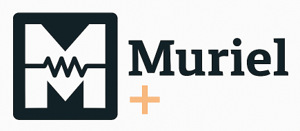
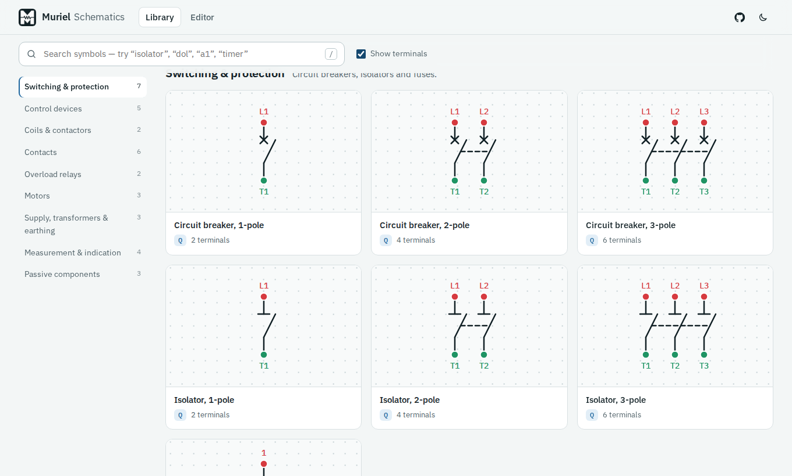
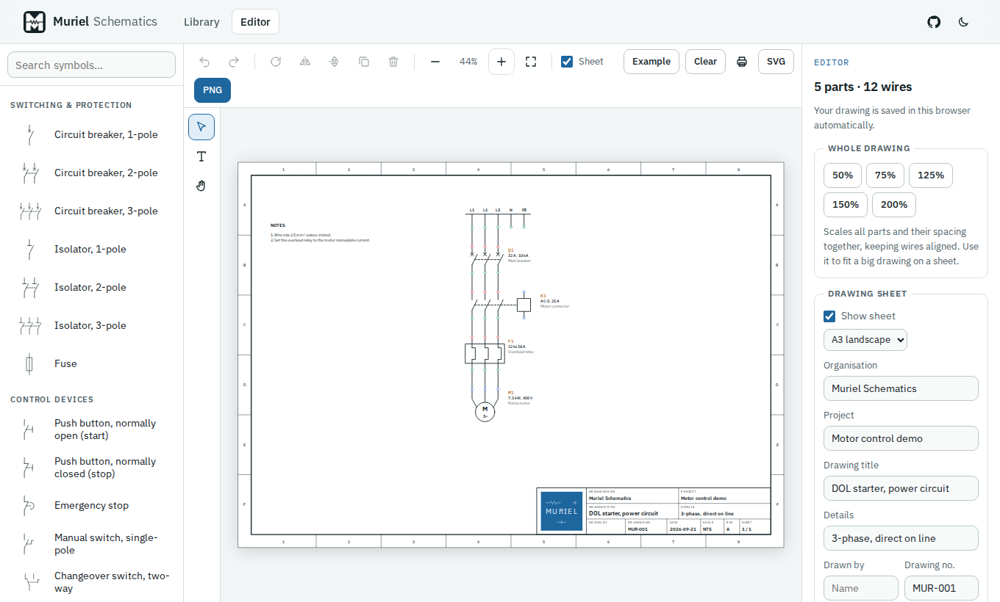
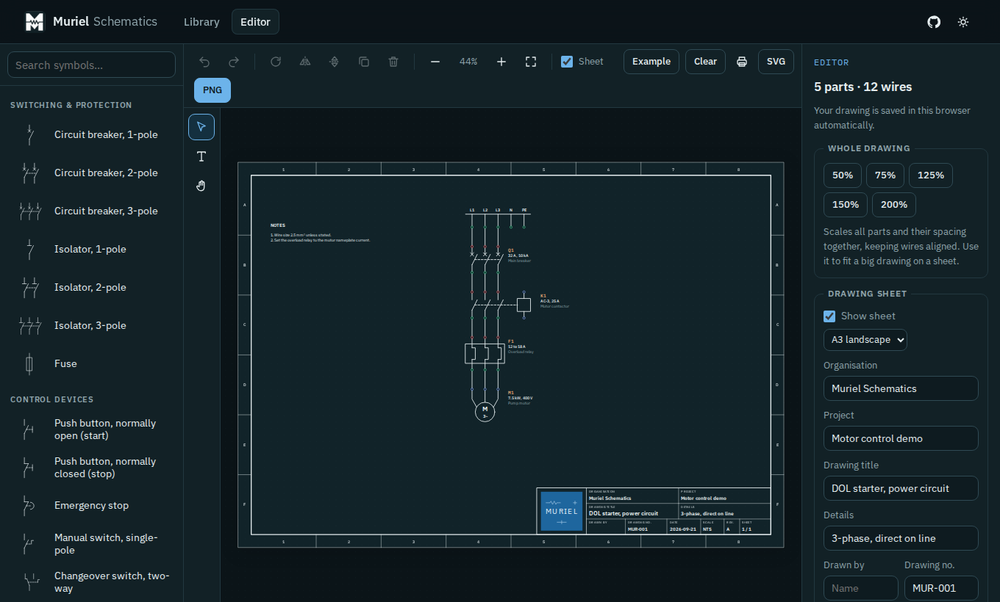
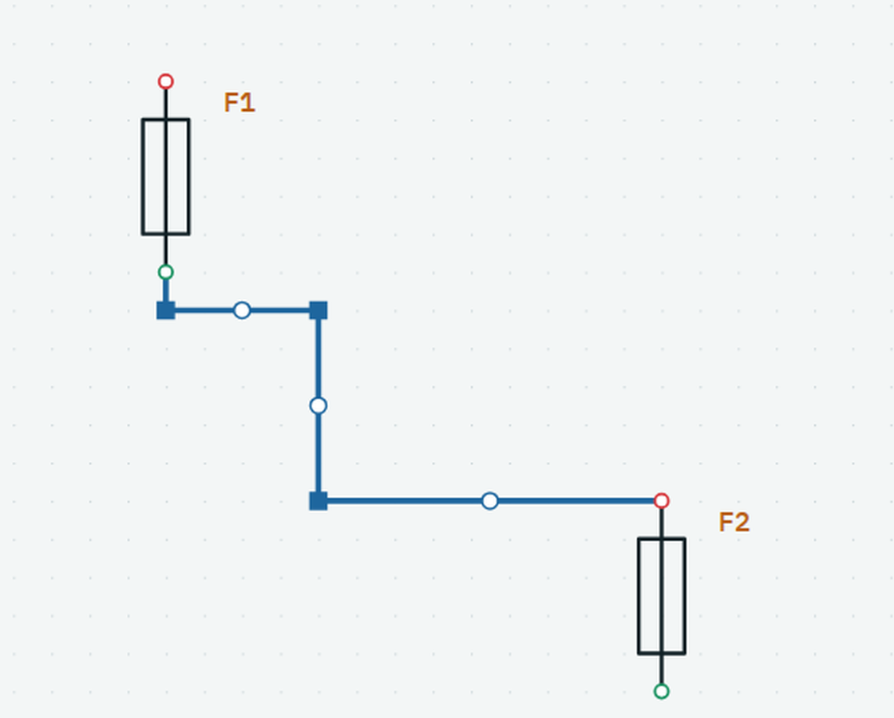
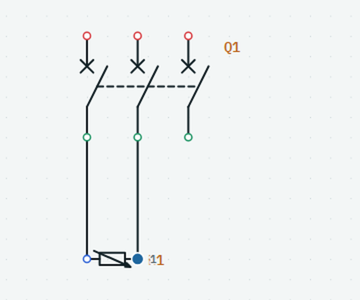

<p align="center">
  
</p>

# Muriel Schematics

A searchable library of IEC-style electrical schematic symbols, plus a small in-browser schematic editor that puts your circuit on a proper drawing sheet with a title block.

**Live demo:** [https://levii17.github.io/muriel-schematics/](https://levii17.github.io/muriel-schematics/) &nbsp;·&nbsp; **Stack:** React 19, TypeScript (strict), Vite, Vitest. React is the only runtime dependency.

| Library | Editor with drawing sheet | Dark theme |
| --- | --- | --- |
|  |  |  |

An exported A3 sheet is in [`docs/example-sheet.svg`](docs/example-sheet.svg).

Hand-routing a wire: its handles after sliding the vertical leg sideways.



Resizing in practice: a 125% breaker and a 50% variable resistor whose leads land exactly on poles T1 and T2, so both wires run straight.



## What it does

**Library**
- 35 symbols in 9 categories: breakers, isolators, fuse, push buttons, e-stop, coils, contactor, contacts (including on-delay timer contacts), overload relays, motors (single-phase, DOL, star-delta), supply, transformer, earth, meters, lamp and passives.
- Weighted search over name, synonyms, reference letter and terminal labels (`isolator`, `dol`, `mcb`, `a1`, `timer`). Press `/` to focus it.
- Optional coloured terminals (input / output / I-O) with labels, and a details drawer listing every terminal and typical use.
- Copy or download any symbol as a standalone SVG, or as a PNG.
- Light and dark themes, keyboard accessible, deep links such as `#/s/contactor-3p`.

**Editor**
- Click a symbol in the palette, click the canvas to place it; everything snaps to a 20 px grid.
- Drag from one terminal to another to draw an orthogonal wire. Wires re-route as parts move.
- **Junctions:** drop a wire onto the middle of another wire and it joins there. A junction dot is created on the spot, the wire you hit is split in two around it (keeping its shape and style), and the whole thing is one undo step. You can also place a Junction from the Connections category and hold `Alt` while dragging from it to start a wire.
- **Hand-routing:** select a wire to see its handles. Drag a round handle to slide that stretch of wire sideways (a short stub is kept at a terminal so it can still jog), drag a square handle to move a bend, double-click a square handle to remove it, or use Reset route. Bends snap to a 10 px grid and line up with nearby terminals, and they travel with the wire when both of its parts move, turn, flip, scale or are pasted.
- **Wire styles:** solid, dashed, dotted or dash-dot, in thin, normal or thick, for one wire or several at once. Styles are drawn in exports and kept by junction splits and copies.
- **Selecting:** drag an empty area for a selection box (left to right selects parts fully inside, right to left selects anything the box touches, like CAD). Shift adds or removes, `Ctrl+A` selects everything. Wires can be selected too, alone or together with parts.
- **Tools:** a rail on the left has Select (`V`), Text (`T`) and Pan (`H`). You can also pan by holding `Space` while dragging, or with the middle mouse button.
- **Rotate and reflect** (`R`, `F` left-right, `Shift+F` top-bottom): one part turns about its own centre, several turn as a group so the wires between them keep their shape. Reflection is real geometry rather than a mirrored picture, so text such as "kWh" stays readable and the timer-contact arc flips correctly. Press `R` or `F` while placing a part to orient it before you drop it.
- **Copy, cut, paste, duplicate** (`Ctrl+C`, `X`, `V`, `D`): pasted parts are renumbered (Q1, Q2, …) and the wires between the copied parts come with them. Custom labels are kept.
- **Text notes:** the Text tool places free text anywhere: click, type, click away. Notes can have several lines, a size, bold, alignment and a quarter-turn rotation. Double-click a note to edit it in place; the panel on the right has the same controls. Notes select, move, copy, paste, delete, scale with the drawing and print like any other object.
- **Part properties:** each part has a reference (Q1), a rating (for example "32 A, 10 kA"), a description ("Main breaker") and a part number. Rating and description are drawn under the reference. The part number is stored for a future bill of materials and is not drawn.
- **Movable labels:** drag a part's label block to wherever it reads best. It keeps that offset when the part moves, and "Reset label position" brings it back.
- **Align and distribute:** with two or more parts selected, align edges or centres, or (three or more) space them with equal gaps.
- Nudge, delete, undo/redo. Parts auto-number (`Q1`, `K1`, `M1`…).
- **Resize parts** (`[` and `]`, or the Size control in the inspector): 50%, 75%, 100%, 125%, 150%, 200%, 250%, 300%. A part grows or shrinks about its first terminal, so its wire stays attached; line weight stays constant. Use it when symbols are out of proportion, for example a resistor bridging two breaker poles.
- **Magnetic alignment:** when you drag or place a part, its terminals snap onto the terminals of other parts within half a grid cell (a dashed guide shows the match). That is how differently sized parts line up exactly, for example a 50% resistor between the poles of a 125% breaker.
- **Whole-drawing scale:** 50% to 200% scales every part and the spacing between them together, keeping wires aligned.
- Pan and zoom, fit to content, autosave to `localStorage`.
- **Drawing sheet** (toggle in the toolbar): A4, A3, A2 or A1 landscape paper with a border, zone references (columns 1–8, rows A–F) and a title block.
- **Title block:** organisation, project, drawing title, details, drawn by, drawing number, date, scale, revision and sheet. Edit the fields in the inspector; the block updates live. Long values are shortened with an ellipsis instead of overflowing their cell.
- **Export:** SVG (sheet sized in millimetres, so it opens at true paper size), PNG, or print / save as PDF from the browser. - **Keeping it on the sheet:** parts outside the frame or under the title block get a red outline and a "n off sheet" chip in the toolbar. "Move onto the sheet" centres the drawing in the free space, switching to the smallest larger paper if needed; if it is too big even for A1, "Shrink to 75% and fit" scales it down and places it.

## Title block layout

The block is 180 × 36 mm and sits flush in the bottom-right corner of the frame:

```
┌────────┬──────────────────────┬──────────────────────┐
│        │ ORGANISATION         │ PROJECT              │
│ MURIEL ├──────────────────────┼──────────────────────┤
│  logo  │ DRAWING TITLE        │ DETAILS              │
│        ├───────┬───────┬──────┼──────┬─────┬────┬─────┤
│        │ DRAWN │ DWG   │ DATE │SCALE │ REV │SHEET│
└────────┴───────┴───────┴──────┴──────┴─────┴─────┘
```

It follows the structure of a typical EGD title block, with the caption above each value (instead of inside it) so blank fields still read clearly. Everything is drawn as ordinary SVG primitives, so the canvas, SVG export and PNG export all render it with the same code. The Muriel logo tile is a vector recreation of `muriel-logo.png`, so it stays sharp when zoomed or printed.

## How it is built

The key design decision: **a symbol is data, not markup.**

```ts
{
  id: 'contactor-3p',
  name: 'Contactor, 3-pole',
  category: 'coils',
  reference: 'K',
  width: 220, height: 80,            // multiples of 20 so rotation pivots stay on the grid
  body: [ ...pole(20, 'no'), link(28, 160), rect(160, 20, 40, 40), ... ],   // drawing primitives
  terminals: [ { id: 'A1', label: 'A1', x: 180, y: 0, role: 'io', dir: 'up' }, ... ],
}
```

One definition drives the React renderer, the standalone-SVG serialiser, terminal overlays, search, the details drawer and the editor's wiring and rotation maths. The drawing sheet uses the same primitives. Adding a symbol means adding an object; the tests then check it.

```
src/
  data/       symbol definitions, primitives (pole(), link(), …), categories
  lib/        search, SVG serialiser + PNG export, print, hooks (hash router, theme, toast)
  components/ library UI: cards, details drawer, glyph renderer, header
  editor/     model & geometry, history reducer, wire routing, transform (rotate/flip), selection,
              clipboard, align/distribute, labels and text notes, wire geometry / junctions / hand-routing, drawing sheet + title block,
              persistence, export, example circuit, Editor and Inspector UI
public/       favicons, web manifest, brand assets
```

`npm test` runs 201 tests covering symbol data integrity, search ranking, terminal positions for every symbol at every size, rotation and reflection, exact group rotate/flip geometry, box selection, clipboard, align and distribute, text notes and part properties (geometry, history, storage, export), wire routing through waypoints, junction splitting, segment sliding, wire styles, symbol scaling (including SVG arcs), orthogonal wire routing, magnetic alignment, the undo/redo reducer, storage validation, sheet and title-block geometry, fit-to-sheet planning, and SVG export.

## Run it

```bash
npm install
npm run dev        # http://localhost:5173
npm test
npm run build      # type-check + production build into dist/
```

Pushing to `main` runs `.github/workflows/deploy.yml` (type-check, test, build, GitHub Pages). In the repository settings set **Pages → Source → GitHub Actions**. The app uses hash routing and relative asset paths, so it works under any sub-path.

## Brand assets

`public/` holds the favicon set and web manifest; `public/brand/` holds the logo mark, the tile and the full lockup. The 16, 32 and 48 px favicons use the "M" mark on its own, because the full wordmark is unreadable that small. The 180, 192 and 512 px icons are the supplied lockup.

## Sizing and routing details

- Sizes are presets rather than free scaling so terminals stay on a 5 px lattice (the grid is 20 px, and 40 px pole pitches map to useful values such as 50 px at 125%). New parts are placed so their first terminal, not their centre, lands on the grid.
- The wire router picks, from a set of straight, L-, Z- and U-shaped candidates, the one with the fewest bends. A wire may leave a terminal straight out or arrive sideways, but never passes back through its own part, and leaving sideways is penalised heavily because it would run along the row of neighbouring terminals and look like a short circuit.
- Part labels keep a fixed size on the sheet whatever the part size.

## Notes on the standards

Symbols follow IEC 60617-style conventions (cross on breaker poles, bar on isolators, NO/NC contact numbering 13-14 / 21-22 / 95-96, "parachute" arc on timer contacts). This is a learning and portfolio reference, **not a certified drawing standard**. Check a symbol against the current IEC 60617 / SANS documents before using it in a deliverable. The title block is modelled on common practice rather than the full ISO 7200 field list.

## Ideas for next steps

Text annotations, a bill of materials from the placed parts, multi-sheet drawings (the `Sheet` field is already there), DIN-rail / panel layout, a netlist export, and a backend (save and share drawings by link) to make it a full-stack piece.

## Licence

MIT. The Muriel name and logo are the author's.